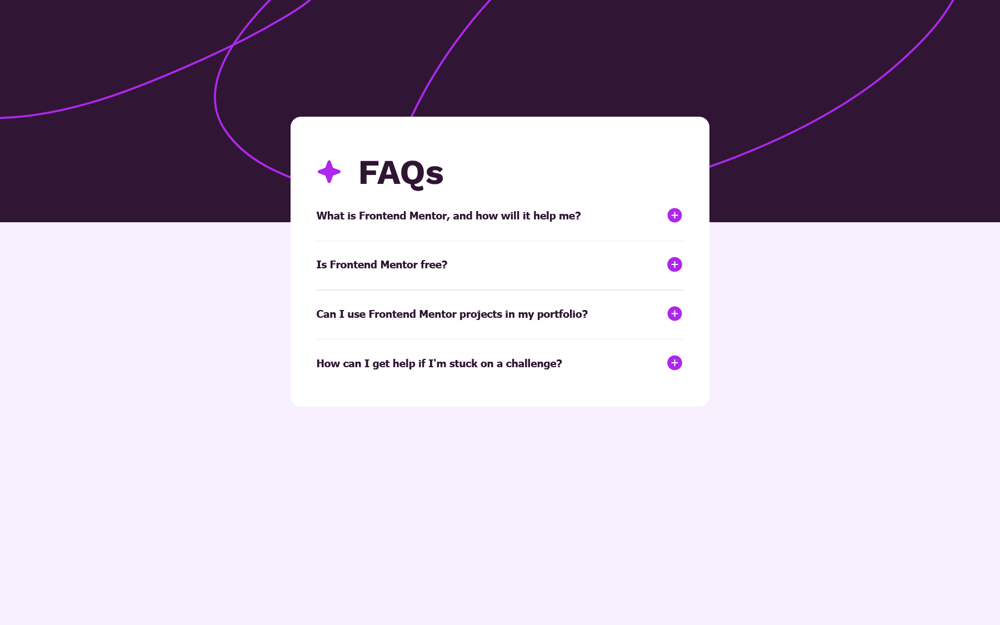

# Frontend Mentor - FAQ accordion solution

This is a solution to the [FAQ accordion challenge on Frontend Mentor](https://www.frontendmentor.io/challenges/faq-accordion-wyfFdeBwBz). Frontend Mentor challenges help you improve your coding skills by building realistic projects. 

## Table of contents

- [Overview](#overview)
  - [Screenshot](#screenshot)
  - [Links](#links)
- [My process](#my-process)
  - [Built with](#built-with)
  - [What I learned](#what-i-learned)
  - [Continued development](#continued-development)
  - [Useful resources](#useful-resources)
- [Author](#author)
- [Acknowledgments](#acknowledgments)

## Overview

### Screenshot




### Links

- Solution URL: [Solution here](https://github.com/MariaCMontO/faq-accordion-cmo)

## My process

### Built with

- Semantic HTML5 markup
- CSS custom properties
- Flexbox
- Grid
- JavaScript

### What I learned

With this project, I learned how to include accesibily. It's important to include atributes like aria-controls, aria-expanded in elements like buttons to make it clear to all people. I also learned that is important to update those atributes with JS when you do an action which requires it.

```html
<div>
        <div class="question-container">
          <button class="question" aria-expanded="false" aria-controls="answer1">
            What is Frontend Mentor, and how will it help me?
            
          </button>
        </div>
        <p class="answer is-hidden" id="answer1">Frontend Mentor offers realistic coding challenges to help developers
          improve
          their frontend coding skills with projects in HTML, CSS, and JavaScript. It's suitable for
          all levels and ideal for portfolio building.</p>
        <hr>
      </div>
```
```js
const containers = Array.from(document.querySelectorAll('.question-container'))
console.log(containers)
//Events
containers.forEach((container) => {
    container.addEventListener('click', (e) => {
        const answer = container.nextElementSibling;
        const plusButton = container.querySelector('.plus-button')
        const button = container.querySelector('.question')
        
        answer.classList.toggle('is-hidden')
        plusButton.src = answer.classList.contains('is-hidden') ? '/assets/images/icon-plus.svg' : '/assets/images/icon-minus.svg';
        button.setAttribute("aria-expanded", !answer.classList.contains('is-hidden'));
        console.log(button)
    });
})
```

### Continued development

I definitely want to keep developing interfaces with JavaScript functions, in order to make them more interactive.

### Useful resources

## Author

- Frontend Mentor - [@MariaCMontO](https://github.com/MariaCMontO)


## Acknowledgments